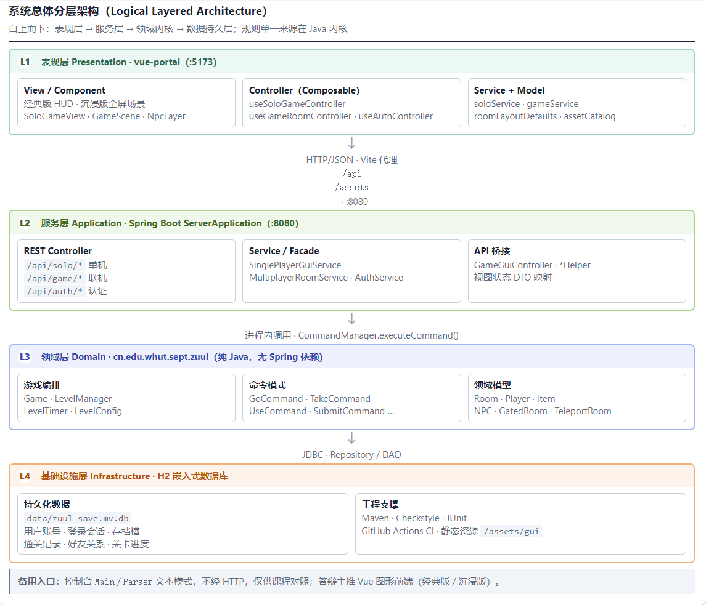
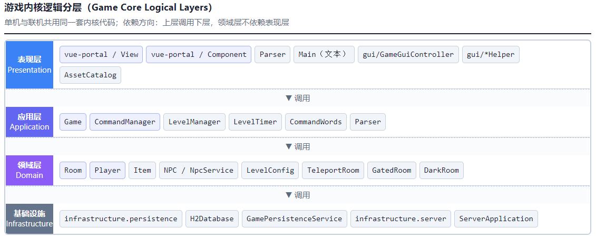
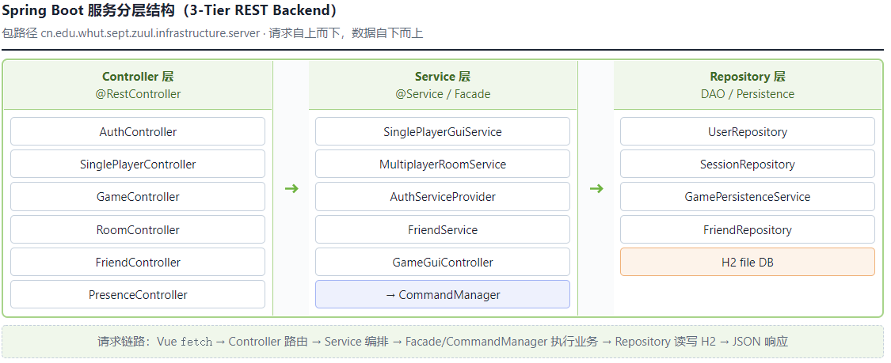
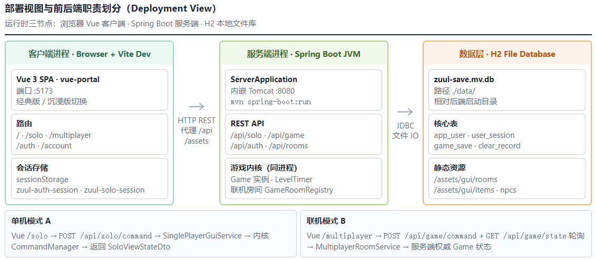
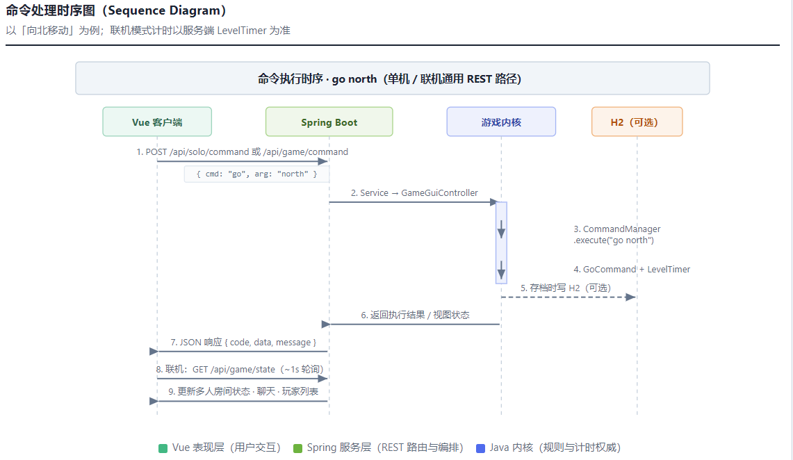

# 《熄灯前归寝》系统架构设计

**项目名称：** 《熄灯前归寝》（World of Zuul 扩展）  
**文档类型：** 系统架构设计说明书  
**小组：** 肖梦琪（组长）、刘晶、彭慧星、庞绮君  
**编写日期：** 2026 年 6 月  
**仓库：** https://github.com/wutcst/kai-fa-519club  

---

## 1. 引言

### 1.1 编写目的

本文档描述《熄灯前归寝》的系统总体架构、前后端划分、技术选型及关键设计决策，供开发、测试与实训答辩使用。

### 1.2 项目背景

本作是基于 World of Zuul 扩展的**闯关解密类游戏**：玩家从校门出发，在五关限时内集齐物品、完成解密，最终回寝室执行 `sleep` 通关。游戏具有**高频命令交互、复杂状态、实时倒计时**等特点。

### 1.3 架构选型结论

本项目采用 **混合架构（Hybrid Architecture）**：

| 组成部分 | 技术 | 职责 |
|----------|------|------|
| 游戏内核 | Java 四层 + 命令模式 | 五关规则、计时、地图、命令（不依赖 Spring） |
| 服务后端 | Spring Boot + Spring MVC + RESTful API | 单机 `/api/solo`、联机 `/api/game`、存档与房间管理 |
| **主前端** | **Vue 3 + TypeScript（`vue-portal/`）** | **经典版 / 沉浸版**；单机 L1→L5、联机大厅与对局 |
| 备用入口 | 文本 `Parser`、`Main` 控制台 | 课程原始文本模式 |
| 持久化 | H2 | 存档槽、通关记录 |

**不采用**将规则全部迁入纯前端的做法；图形玩法经 **REST 调用 Spring**，由 Facade 转调内核，规则仍集中在 Java 领域层。

---

## 2. 架构选型分析

### 2.1 候选方案对比

| 方案 | 描述 | 结论 |
|------|------|------|
| 纯 B/S | Vue SPA 做游戏 UI，所有操作走 REST | ⚠️ 有网络延迟，但本组已用轮询/命令 API 落地，**答辩主入口** |
| 纯桌面 | 仅 Java Swing + H2，无 Spring/Vue | ⚠️ 玩法可行，但课程 Spring/Vue 体现不足 |
| **混合架构** | Java 内核 + Spring REST + **Vue 唯一图形前端** | ✅ **采用** |

### 2.2 选型依据

1. 游戏操作为**命令驱动**；规则仍在 Java 内核，Spring 通过 Facade 调用，**不在 Web 层重复实现五关逻辑**。
2. 单机与联机均由 **Spring Boot** 提供 REST，Vue 客户端通过 `/api/solo`、`/api/game` 驱动状态。
3. **Vue 3** 为唯一图形前端：经典版 / 沉浸版，承担单机与联机全部 UI。
4. H2 存档与统计由 Service + Repository 提供，经 REST 供 Vue 使用。

---

## 3. 系统总体架构

### 图 1　系统总体架构（混合架构）



*图 1：客户端层 → 游戏内核 → Spring Boot 服务 → H2 数据库*

系统自上而下分为四层部署视图：

```
客户端层（Vue 3 图形前端 + 控制台 Parser）
        ↓ HTTP REST / 本地进程内调用
游戏内核（Java 四层 + 命令模式）
        ↓ 单机会话、联机房间、存档
服务后端（Spring Boot + Spring MVC + REST）
        ↓
H2 数据库
```

### 3.1 客户端层

| 组件 | 技术 | 说明 |
|------|------|------|
| **主前端** | Vue 3、Vue Router、TypeScript、Composables | `/solo` 单机、`/multiplayer` 联机；经典版 / 沉浸版 |
| 备用入口 | `Parser`、`Main` | 文本控制台，非图形界面 |
| 静态资源 | `/assets/gui` | 房间底图、物品图标、NPC 立绘；Java 与 Vue 共用 |

### 3.2 游戏内核

单机与联机**共用**同一套规则代码，包路径 `cn.edu.whut.sept.zuul`，**不引入 Spring 依赖**。

### 图 2　游戏内核四层架构



*图 2：表现层 / 应用层 / 领域层 / 基础设施*

| 层 | 主要类 |
|----|--------|
| 表现层 | `Parser`、`vue-portal` View/Component |
| 应用层 | `Game`、`LevelManager`、`LevelTimer`、`CommandManager`、`gui/*Helper`（Vue API 桥接） |
| 领域层 | `Room`、`Player`、`Item`、`NPC`、`LevelConfig`、`TeleportRoom` |
| 基础设施 | `infrastructure.persistence`（单机 H2 DAO） |

### 3.3 服务后端

包路径 `cn.edu.whut.sept.zuul.infrastructure.server`，独立 `ServerApplication` 启动。

### 图 3　Spring Boot 服务后端三层



*图 3：Controller → Service → Repository*

| 层 | 职责 | 示例 |
|----|------|------|
| Controller | REST 入口 | `@RestController` |
| Service | 业务编排 | `GameEngineFacade`、`MultiplayerSessionService` |
| Repository | 数据访问 | `SaveRepository`、`ClearRecordRepository` |

`GameEngineFacade` 内部调用内核 `CommandManager`，**不在 Spring 层重复实现五关规则**。

### 3.4 持久化层

H2 嵌入式数据库，**本地文件库**（`jdbc:h2:file:./data/zuul-save`，相对后端启动目录）。**不随 Git 同步**；换电脑需复制 `data/` 或重新注册。

**仅存储摘要字段：**

- 当前关卡号、剩余秒数、玩家昵称（存档）
- 用户账号、登录会话、好友关系
- 通关关卡、通关时间（记录）

不序列化完整 `Game` 对象图。

---

## 4. 前后端架构

### 图 4　前后端职责划分



*图 4：Vue 前端负责全部图形玩法（经典版 / 沉浸版）*

### 4.1 主前端（Vue）— 游戏 Web 客户端

- **单机模式**：Vue `/solo` → `POST /api/solo/command` 等 → `SinglePlayerController` → 内核。
- **联机模式**：Vue `/multiplayer` → `POST /api/game/command`、`GET /api/game/state` → `GameEngineFacade` → 内核。
- 职责：五关主玩法、经典/沉浸双模式、背包与房间物品、NPC 对话、计时压力、结局/锁门弹层。
- 前端 MVC：`model/` 类型与布局、`service/` REST、`controller/` Composable 编排、`view/` + `component/` 展示。

### 4.2 服务后端（Spring Boot）— API 服务

- 提供 RESTful JSON 接口，内嵌 Tomcat，默认端口 `8080`。
- 联机场景下持有**权威** `Game` 实例与 `LevelTimer`，计时以服务端为准。

---

## 5. 运行形态

### 图 5　联机模式命令时序



*图 5：Vue → REST → Spring Boot → 内核 → JSON 响应；计时以服务端 LevelTimer 为准*

| 形态 | 前端 | 后端 | 场景 |
|------|------|------|------|
| **A 单机** | Vue `/solo`（经典 / 沉浸） | Spring Boot `/api/solo` + 内核 | 五关主流程 |
| **B 联机** | Vue `/multiplayer` | Spring Boot `/api/game` + 服务端 Game | F6 多人演示 |
| **C 文本** | 控制台 `Main` / `Parser` | 进程内 Java 内核 | 课程原始模式 |
| **D 存档/统计** | Vue | Spring Boot REST + H2 | 读档、通关记录 |

---

## 6. RESTful API 设计

| 方法 | 路径 | 说明 | 调用方 |
|------|------|------|--------|
| POST | `/api/solo/sessions` | 创建单人会话 | Vue |
| GET | `/api/solo/sessions/{id}/state` | 拉取单机视图状态 | Vue |
| POST | `/api/solo/command` | 执行单机命令 | Vue |
| POST | `/api/solo/look`、`/api/solo/talk` | 环顾、对话 | Vue |
| GET | `/api/saves/{id}` | 读档 | Vue |
| POST | `/api/saves` | 存档 | Vue |
| GET | `/api/records` | 通关记录 | Vue |
| GET | `/api/rooms` | 联机房间列表 | Vue |
| POST | `/api/rooms` | 创建联机房间 | Vue |
| POST | `/api/rooms/{id}/join` | 加入房间 | Vue |
| POST | `/api/game/command` | 执行命令（联机） | Vue |
| GET | `/api/game/state` | 获取游戏状态 | Vue |

**统一响应格式：**

```json
{
  "code": 0,
  "data": {
    "level": 2,
    "remainingSeconds": 187,
    "roomDescription": "博学北楼二楼转角…"
  },
  "message": "ok"
}
```

---

## 7. 课程技术应用映射

| 课程技术 | 是否采用 | 工程位置 |
|----------|----------|----------|
| Spring | ✅ | `infrastructure.server`：IoC、事务 |
| Spring Boot | ✅ | `ServerApplication`，内嵌 Tomcat |
| Spring MVC | ✅ | `@RestController`，REST 接口层 |
| RESTful API | ✅ | `/api/solo/*`、`/api/game/*`、`/api/auth/*`；Vue 经 REST 驱动状态 |
| Vue | ✅ | `vue-portal/` 主前端（单机 + 联机） |
| 分层 + 命令模式 | ✅ | 游戏内核 |

**内核内的 MVC 对照：** `Command` ≈ Controller，`Room`/`Player` ≈ Model，Vue Component ≈ View。

**Vue 端 MVC：** `service` ≈ 数据访问，`controller`（Composable）≈ 应用编排，`view`/`component` ≈ 表现层；规则仍在 Java 内核。

---

## 8. 代码包结构

```
world-of-zuul/
├── src/main/java/cn/edu/whut/sept/zuul/
│   ├── Game.java, Room.java, Player.java …
│   ├── command/                    # 各 Command 类
│   ├── level/                      # LevelManager, LevelTimer, LevelConfig
│   ├── gui/                        # Vue API 桥接（GameGuiController、*Helper、AssetCatalog）
│   └── infrastructure/
│       ├── persistence/            # 单机 H2 DAO（F8）
│       └── server/                 # Spring Boot（F6 + REST）
│           ├── ServerApplication.java
│           ├── controller/
│           ├── service/
│           ├── repository/
│           └── dto/
├── vue-portal/                     # Vue 3 主前端（MVC 分层）
│   └── src/{model,service,controller,view,component}
└── docs/
    ├── 系统架构设计.md              # 本文档
    ├── 系统架构图.html              # 浏览器打开导出架构图
    └── images/                     # 架构图截图（fig1—fig5）
```

在线架构图：[系统架构图.html](系统架构图.html)

---

## 9. 关键设计决策

1. **地图一次构建**：`Game.createRooms()` 定义十房固定拓扑；关卡差异由 `LevelManager` 控制出口与物品刷新。
2. **命令模式扩展**：`use`、`submit`、`combine` 等独立成类并注册，符合开闭原则。
3. **计时横切**：`LevelTimer` 统一管理「距熄灯（23:00）还有 XXX 秒」；联机以 Spring 服务端为准。
4. **规则单一来源**：Spring 通过 `GameEngineFacade` 调用 `CommandManager`，避免 Web 层重复业务逻辑。
5. **轻量存档**：H2 仅存关卡号、剩余秒数、通关记录，读档时由 `LevelManager` 重建状态。
6. **前端唯一图形入口**：Vue 经典版 / 沉浸版承担全部 GUI；规则单一来源仍在内核。

---

## 10. 部署与构建

| 组件 | 启动方式 | 端口 |
|------|----------|------|
| Spring Boot 服务 | `mvn spring-boot:run`（主类 `ServerApplication`） | 8080 |
| Vue 开发服务 | `cd vue-portal && npm run dev`（代理 `/api`、`/assets` → 8080） | 5173 |
| 控制台文本 | `java -jar target/*-jar-with-dependencies.jar`（`Main`） | — |

**本地门禁（与 CI 对齐）：**

```powershell
mvn checkstyle:check
mvn test
cd vue-portal; npm run build
```

CI：GitHub Actions 执行 `mvn checkstyle:check` → `mvn test` → `mvn package`（Java）；Vue 构建在合并前本地执行 `npm run build`。
